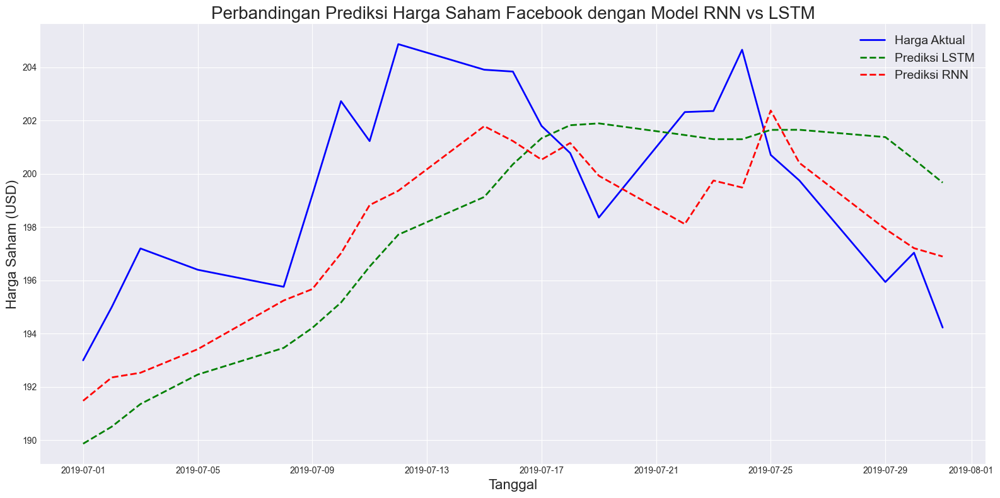
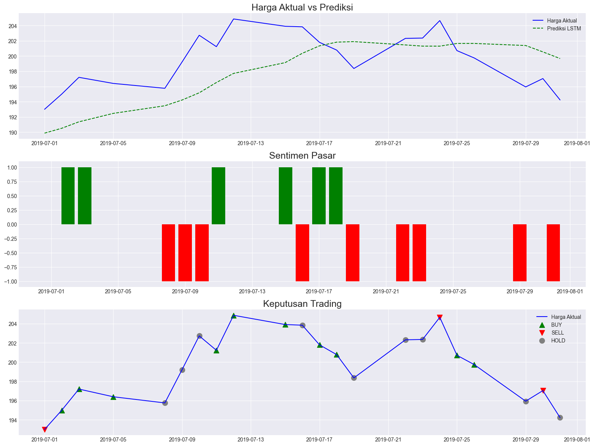
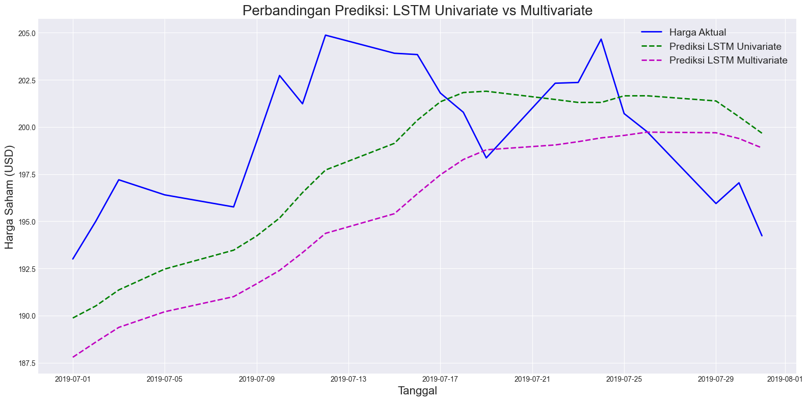
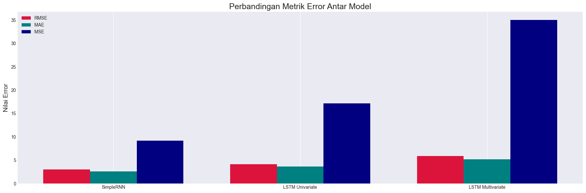

# Prediksi Harga Saham Facebook menggunakan RNN dan LSTM

## Deskripsi Proyek
Proyek ini bertujuan untuk memprediksi harga saham Facebook (FB) menggunakan dua jenis model jaringan saraf tiruan, yaitu **Recurrent Neural Network (RNN)** dan **Long Short-Term Memory (LSTM)**. Kedua model ini digunakan untuk menangkap pola dalam data urutan waktu (time series) yang digunakan untuk meramalkan pergerakan harga saham di masa depan.

Model **LSTM** lebih unggul dibandingkan dengan **RNN** dalam mengatasi masalah seperti *vanishing gradient*, sehingga lebih efektif dalam memprediksi harga saham yang memiliki dependensi jangka panjang.

## Fitur Utama
- **RNN**: Menggunakan jaringan saraf berulang untuk menangkap informasi jangka pendek dari data historis harga saham.
- **LSTM**: Menggunakan mekanisme *memory* yang memungkinkan model untuk mengingat informasi lebih lama dan menangani dependensi jangka panjang.
- **Visualisasi Prediksi**: Membandingkan hasil prediksi antara model RNN dan LSTM dengan data aktual.
- **Evaluasi Model**: Menggunakan metrik seperti **MSE**, **RMSE**, **MAE**, dan **R²** untuk mengevaluasi akurasi kedua model dalam memprediksi harga saham.
- **Analisis Sentimen untuk Trading**: Menambahkan analisis sentimen dari berita dan media sosial untuk meningkatkan prediksi harga saham.
- **Multivariate Time Series dengan LSTM**: Menggunakan lebih dari satu fitur (seperti harga saham, volume perdagangan, dll.) untuk meningkatkan akurasi model dalam memprediksi harga saham.

## Teknologi yang Digunakan
- **Python**: Bahasa pemrograman utama.
- **pandas**: Untuk manipulasi data dan pengolahan data time series.
- **matplotlib & seaborn**: Untuk visualisasi data dan hasil prediksi.
- **tensorflow/keras**: Untuk membangun dan melatih model RNN dan LSTM.

## Langkah Penggunaan
1. **Mempersiapkan Data**: Pastikan data harga saham Facebook dalam format CSV  dengan kolom seperti `Date`, `Open`, `High`, `Low`, `Close`, dan `Volume` berada pada file yang sama dengan code.
2. **Jalankan Notebook**: Buka file `fb_stock_prediction.ipynb` menggunakan Jupyter Notebook atau Google Colab, kemudian jalankan setiap sel untuk memulai proses pelatihan dan prediksi.
3. **Evaluasi Hasil**: Hasil prediksi dari model RNN dan LSTM akan ditampilkan bersama dengan grafik perbandingan antara harga saham yang diprediksi dan data aktual.

## Contoh Hasil
Berikut adalah contoh visualisasi hasil prediksi harga saham yang dihasilkan oleh model LSTM dan RNN:

 
 Prediksi Sentimen untuk Trading dengan RNN/LSTM 
 

 Di bawah ini adalah contoh implementasi lain menggunakan LSTM untuk prediksi harga saham dengan pendekatan multivariate, di mana kita menggunakan beberapa fitur input (tidak hanya harga penutupan).
 

## Metrik Evaluasi
- **MSE (Mean Squared Error)**: Mengukur rata-rata dari kuadrat selisih antara nilai yang diprediksi dan nilai aktual.
- **RMSE (Root Mean Squared Error)**: Menghitung akar kuadrat dari MSE, memberikan gambaran yang lebih jelas tentang seberapa besar kesalahan model.
- **MAE (Mean Absolute Error)**: Mengukur rata-rata selisih absolut antara prediksi dan nilai aktual.
- **R² (R-squared)**: Mengukur seberapa baik model dapat menjelaskan variasi dalam data.

Perbandingan Metrik Antar Model 
 

## Kesimpulan
Model **LSTM** lebih unggul dalam memprediksi harga saham dibandingkan dengan **RNN**, terutama karena kemampuannya dalam menangkap dependensi jangka panjang. Proyek ini menunjukkan bagaimana teknik deep learning dapat diterapkan untuk memprediksi harga saham di pasar finansial yang dinamis. 

**Catatan**: Untuk implementasi yang lebih nyata dalam trading, penting untuk menggabungkan hasil prediksi ini dengan analisis fundamental, analisis sentimen pasar, dan strategi manajemen risiko yang baik.

## Pengembangan Selanjutnya
- Menambahkan fitur teknikal lainnya dalam prediksi.
- Menggunakan arsitektur deep learning yang lebih kompleks seperti **Transformer**.
- Menerapkan teknik **ensemble learning** untuk meningkatkan akurasi.
- Mengintegrasikan analisis sentimen dari berita dan media sosial untuk meningkatkan prediksi.

## Author
ammarqy
